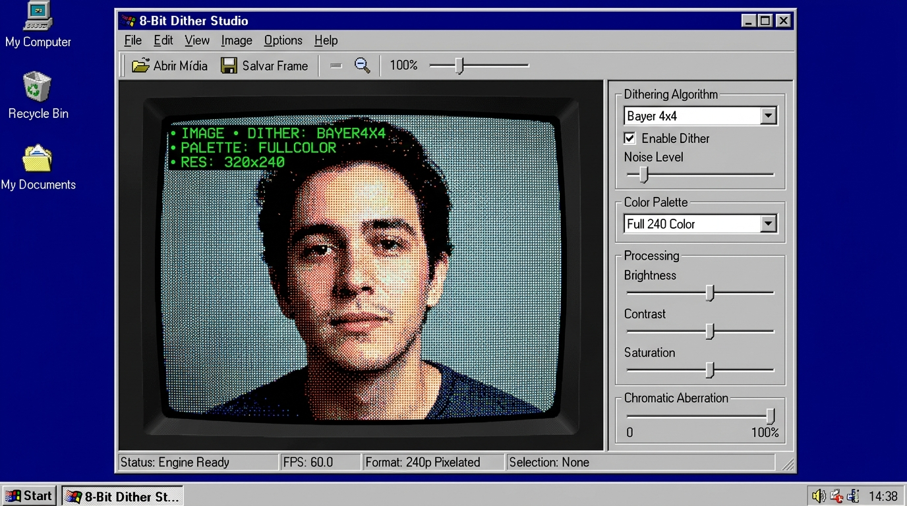
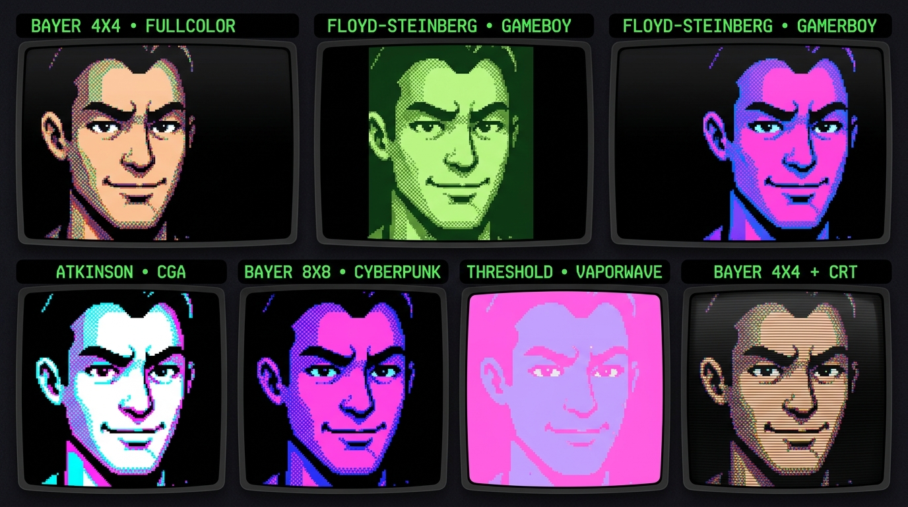
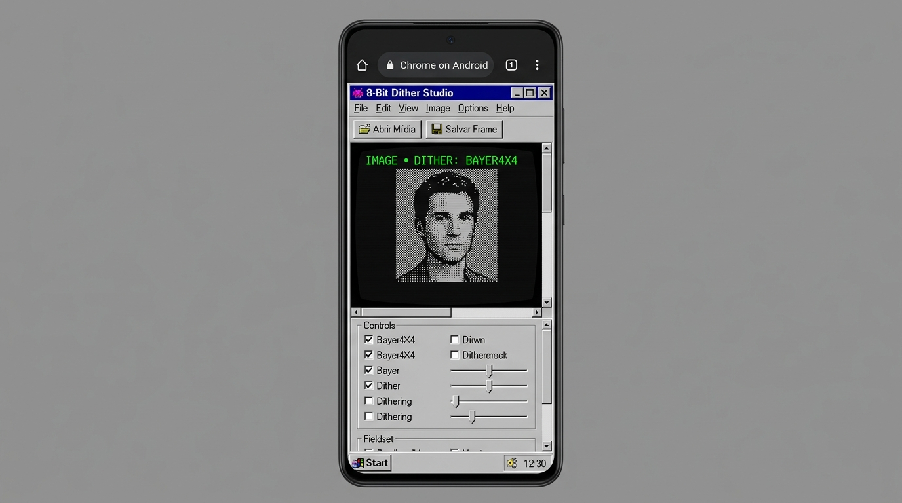

# 8-Bit Dither Studio

<p align="center">
  
</p>

<p align="center">
  <a href="https://editor-8-bit.vercel.app/" target="_blank">
    
  </a>
  
  
  
  
</p>


Processador gráfico retrô que roda 100% no navegador. Carregue uma imagem, GIF ou vídeo curto e veja o pipeline de dithering, quantização de paleta e downscaling trabalhando em tempo real no HTML5 Canvas, tudo empacotado numa interface que imita o Windows Media Player rodando num desktop Windows 98.

---

## Como funciona

O `VideoPipelineEngine` registra um loop de `requestAnimationFrame` que, a cada quadro:

1. Redimensiona a mídia de entrada para a resolução alvo (ex.: 240p) num canvas de processamento off-screen.
2. Aplica ajustes de brilho e contraste diretamente nos dados de pixel via `ImageData`.
3. Roda o algoritmo de dithering escolhido (Bayer, Floyd-Steinberg, Atkinson ou Threshold) com a paleta configurada.
4. Aplica aberração cromática via múltiplos `drawImage` deslocados, se ativada.
5. Sobe o resultado para o canvas principal com `image-rendering: pixelated`.

O React não toca no canvas — ele só repassa mudanças de configuração via uma ref mutável, sem provocar re-renders durante o loop de render.

---

## Paletas e algoritmos

<p align="center">
  
</p>

Algoritmos disponíveis:

- **Bayer 4x4** — dithering ordenado clássico, padrão xadrez visível
- **Bayer 8x8** — mesmo princípio, máscara maior, resultado mais suave
- **Floyd-Steinberg** — difusão de erro, mais fiel ao original
- **Atkinson** — difusão mais suave, estética MacPaint/HyperCard
- **Threshold** — sem dithering, apenas quantização direta

Paletas disponíveis:

- **Full Color** — quantização livre com N níveis por canal (configurável de 2 a 16)
- **Game Boy** — 4 tons de verde
- **IBM CGA** — ciano, magenta, branco e preto
- **Cyberpunk** — roxo e ciano neon
- **Vaporwave** — rosa e lilás pastel

---

## Mobile

<p align="center">
  
</p>

Em telas abaixo de 768px, a janela ocupa a tela inteira (sem bordas), o canvas fica fixo no topo com `position: sticky` enquanto os controles rolam embaixo. Assim dá para ajustar os sliders e ver a prévia sem subir a página.

---

## Stack

| Camada | Tecnologia |
|---|---|
| UI | React 19 + TypeScript |
| Build | Vite 6 |
| Renderização | HTML5 Canvas 2D API |
| Decodificação GIF | `gifuct-js` |
| Estilo | `98.css` + overrides CSS personalizados |
| Deploy | Vercel |

---

## Estrutura do projeto

```text
src/
├── App.tsx                        # Shell do desktop Win98, upload e estado global
├── components/
│   ├── CanvasPlayer.tsx           # Loop de playback, drag-and-drop, exportação
│   ├── ControlsPanel.tsx          # Painel de controles (algoritmo, paleta, sliders)
│   └── Taskbar.tsx                # Taskbar Win98 com relógio isolado
├── engine/
│   ├── videoPipelineEngine.ts     # Orquestrador do loop de render
│   ├── ditheringAlgorithms.ts     # Bayer, Floyd-Steinberg, Atkinson, Threshold
│   ├── ditheringMatrices.ts       # Matrizes Bayer 4x4 e 8x8
│   └── gifDecoder.ts              # Wrapper para gifuct-js
└── types/
    └── pipeline.ts                # Tipos da configuração do pipeline
```

---

## Rodando localmente

```bash
npm install
npm run dev
```

Abra `http://localhost:5173` no navegador.

```bash
npm run build   # build de produção
npm run preview # preview do build
```


---

## Licença

MIT
