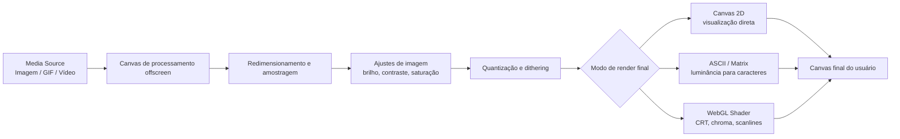

# editor-8-bit

Editor de retro-graphics e efeitos 8-bit em tempo real no navegador, com pipeline de processamento de imagem e vídeo, quantização de cores, dithering, ASCII/matrix e pós-processamento em WebGL.

## Visão geral

O projeto foi pensado como um ambiente de experimentação visual para renderização retrô em tempo real. Ele aceita imagens, GIFs e vídeos curtos, aplica downscaling e filtros em um canvas offscreen, e então escolhe um modo final de exibição: processamento direto em Canvas 2D, mapping para ASCII/matrix ou pós-processamento com shader WebGL.

A arquitetura prioriza três objetivos principais:

- controle preciso do pipeline de pixels em JavaScript;
- estética retro funcional e com baixo custo computacional;
- uma interface inspirada em software clássico, mantendo o código limpo e modular.

## Principais funcionalidades

- Upload de imagens, GIFs e vídeos curtos
- Redimensionamento de mídia para resolução alvo controlada
- Ajustes de brilho, contraste e saturação em tempo real
- Quantização de cores em paletas 8-bit e presets retrô
- Algoritmos de dithering: Bayer 4x4, Bayer 8x8, Floyd-Steinberg e Atkinson
- Renderização em ASCII / matrix com mapas de luminância
- Pós-processamento visual com WebGL: curvatura, scanlines, sweep e aberrração cromática
- Interface desktop inspirada em Windows 98 com painel de controles interativos
- Exportação da visualização final em imagem

## Diagrama do pipeline de processamento de mídia


```mermaid
flowchart LR
    A[Media Source<br/>Imagem / GIF / Vídeo] --> B[Canvas de processamento offscreen]
    B --> C[Redimensionamento e amostragem]
    C --> D[Ajustes de imagem<br/>brilho, contraste, saturação]
    D --> E[Quantização e dithering]
    E --> F{Modo de render final}
    F --> G[Canvas 2D<br/>visualização direta]
    F --> H[ASCII / Matrix<br/>luminância para caracteres]
    F --> I[WebGL Shader<br/>CRT, chroma, scanlines]
    G --> J[Canvas final do usuário]
    H --> J
    I --> J
```

## Arquitetura em alto nível

A lógica principal está concentrada em um pipeline de processamento em Canvas 2D. O fluxo geral funciona assim:

1. A mídia é carregada como elemento de imagem, vídeo ou frame de GIF.
2. Uma cópia offscreen do canvas recebe o conteúdo em uma resolução alvo menor, reduzindo custo de processamento e melhorando a performance.
3. Os pixels são lidos com `getImageData`, permitindo filtros por canal e quantização por nível.
4. A etapa de dithering e de paleta aplica aproximações visuais para reproduzir o aspecto de sistemas limitados em bits.
5. O resultado pode seguir para renderização direta no canvas, para mapeamento de luminância em ASCII ou para efeito de pós-processamento em WebGL.
6. A UI em React apenas dispara configurações e não participa do loop de animação, evitando re-renders caros a cada frame.

Essa separação é importante: o processamento gráfico intenso fica no código de render em JavaScript/Canvas, enquanto a interface permanece reativa e enxuta.

## Tecnologias utilizadas

- React 19
- TypeScript
- Vite
- HTML5 Canvas 2D API
- WebGL
- gifuct-js para decodificação de GIFs
- CSS e 98.css para a estética desktop retrô
- Vercel para deploy

## Estrutura do projeto

```text
src/
├── App.tsx
├── components/
│   ├── CanvasPlayer.tsx
│   ├── ControlsPanel.tsx
│   ├── FileUpload.tsx
│   ├── Header.tsx
│   └── Taskbar.tsx
├── engine/
│   ├── AsciiEngine.ts
│   ├── ShaderPipeline.ts
│   ├── ditheringAlgorithms.ts
│   ├── ditheringMatrices.ts
│   ├── gifDecoder.ts
│   └── videoPipelineEngine.ts
├── types/
│   └── pipeline.ts
├── index.css
├── main.tsx
├── retro-overrides.css
└── App.tsx
```

## Como executar localmente

```bash
npm install
npm run dev
```

A aplicação fica disponível em:

```text
http://localhost:5173
```

Para build de produção:

```bash
npm run build
npm run preview
```

## Licença

MIT
